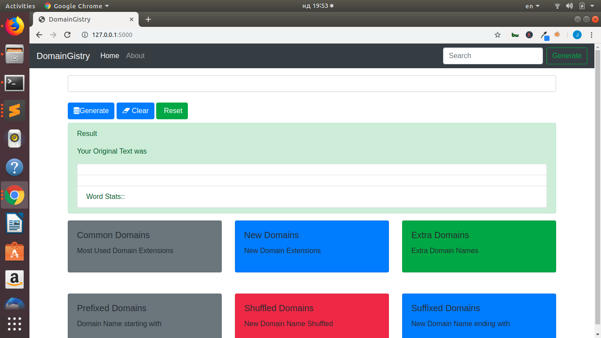
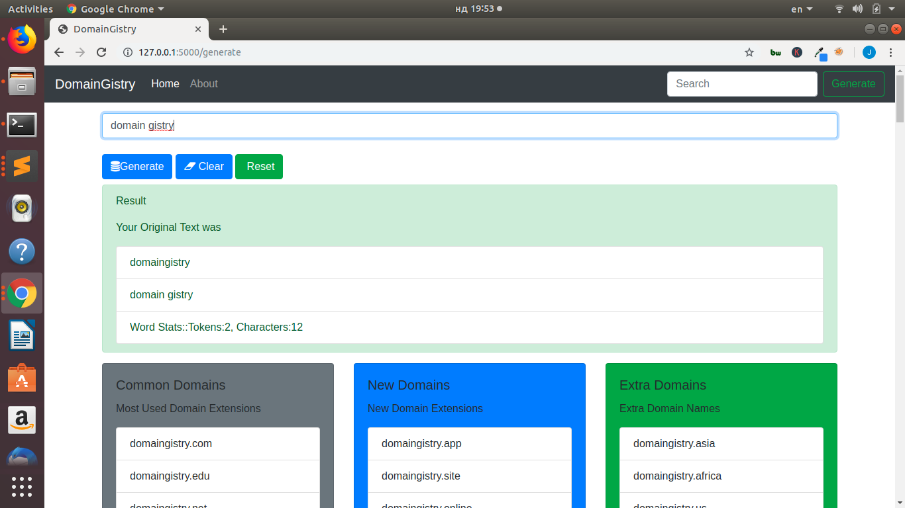
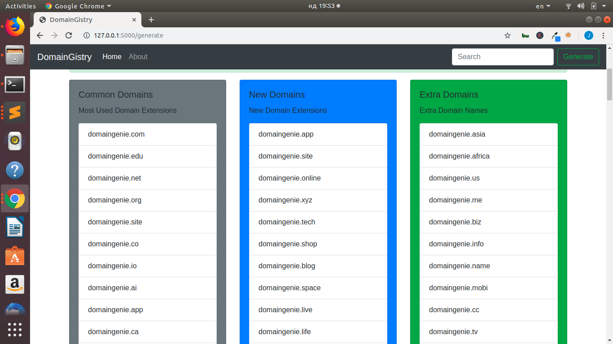

## DomainGistry - A Domain Name Generation Web App

### A Simple Flask Web App For Generating Domain Names


### Usage
+ change to the directory
```python app.py
```

#### Requirements
+ Flask

#### Images/Screenshots


##### Generating A Domain Name


##### Results of Names Generated



### By
+ Jesse E. Agbe(JCharis)
+ Jesus Saves @JCharisTech

