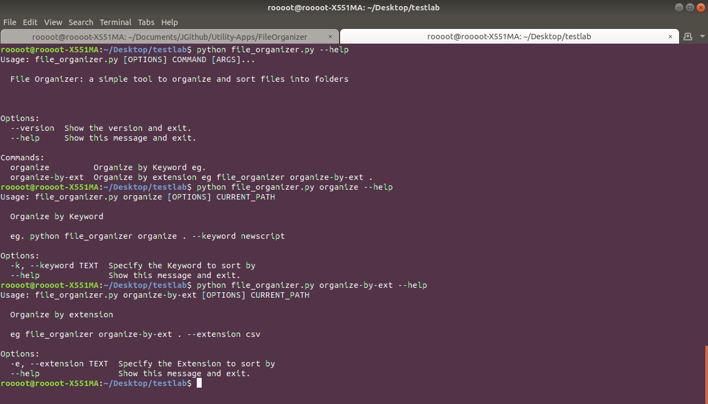
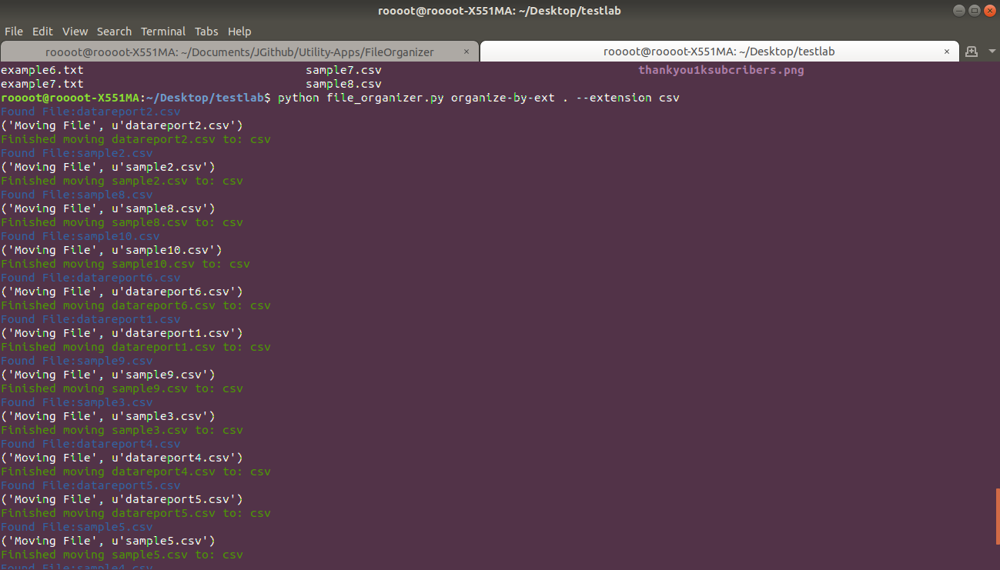
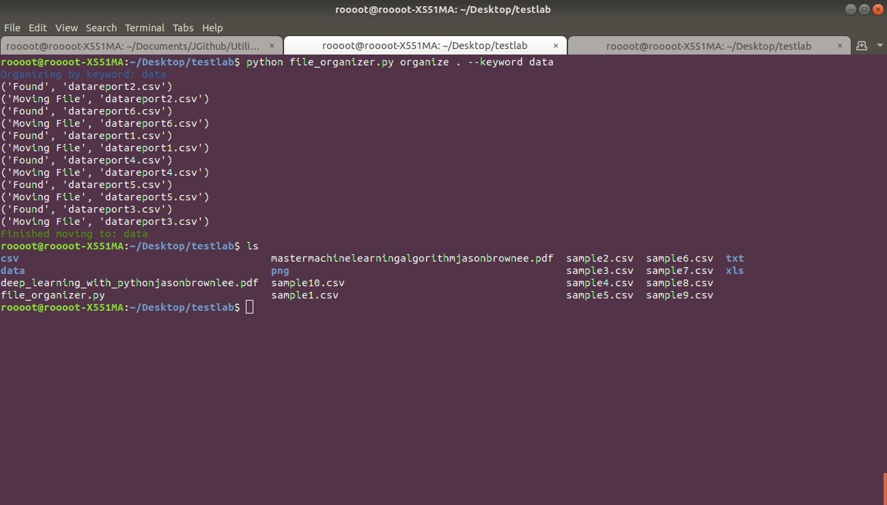

### File Organizer

+ A simple tool to organize and sort your files into the right folders.
+ Organization made simple and fun

#### Requirement
+ click
+ shutil
+ fnmatch

#### Usage
+ Organize By Keyword
```bash
python file_organizer.py organize . --keyword data
```

```bash
python file_organizer.py organize . -k data
```

+ Organize By Extension
```bash
python file_organizer.py organize . --extension txt
```

```bash
python file_organizer.py organize . -e txt
```

#### Screenshot



#### Example Organize By Extension



#### Example Organize By Keyword


##### By
+ Jesse E.Agbe(JCharis)
+ Jesus Saves@JCharisTech
+ J-Secur1ty