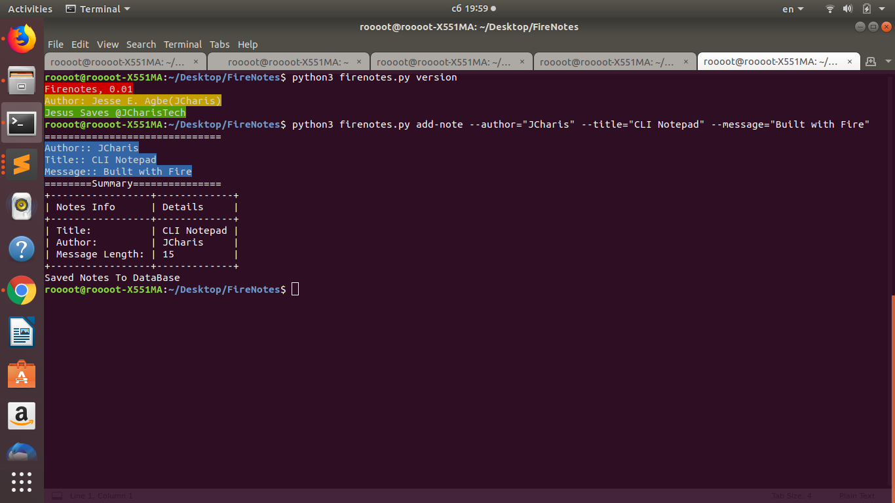
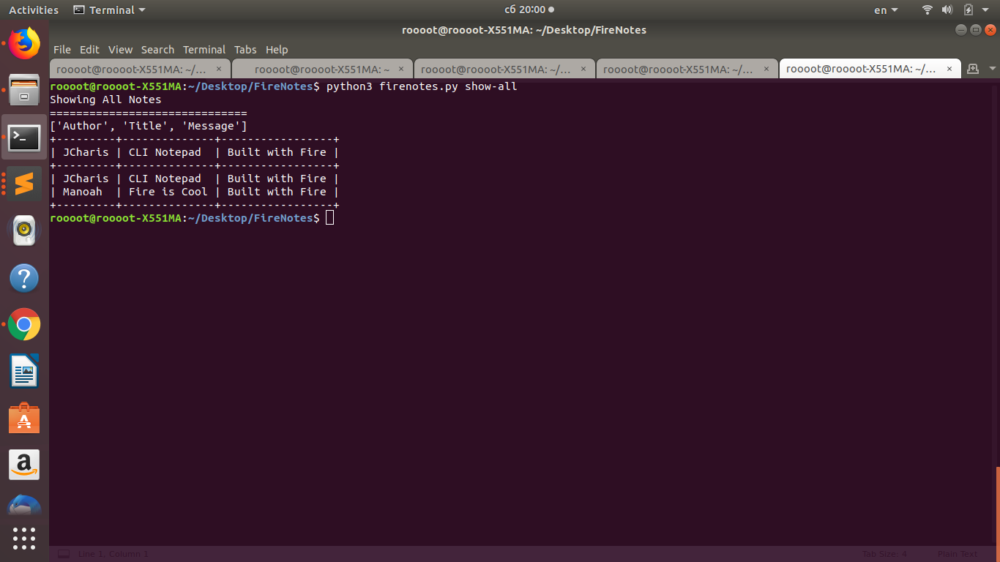

### README

### FireNotes
+ A Simple Note Taking CLI notepad built with Google Fire CLI

#### Requirements
+ Fire
+ Colorama
+ TerminalTables
+ Sqlite3


### Benefits
+ Easy to use
+ Save your notes via the CLI
+ Cross Platform via Python

### Features
+ Add Notes
+ Edit Notes
+ Search Notes


#### Usage
```bash

python firenotes.py --help 

```

#### Adding Notes 
+ Method 1 Via Arguments



#### Show All Notes
+ 


#### Search Notes By [Title/Author/Message]


#### More To Add


#### By
+ Jesse E.Agbe(JCharis)
+ Jesus Saves@JCharisTech


