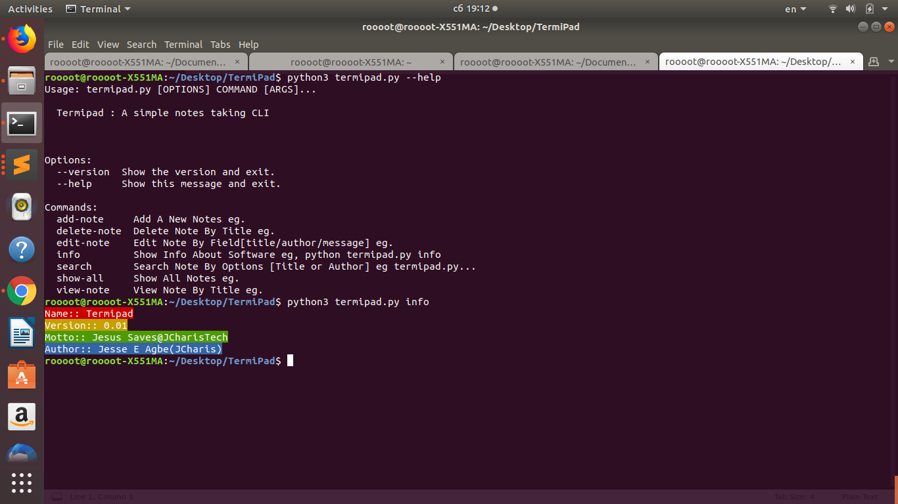
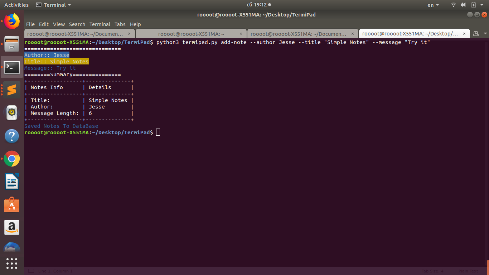
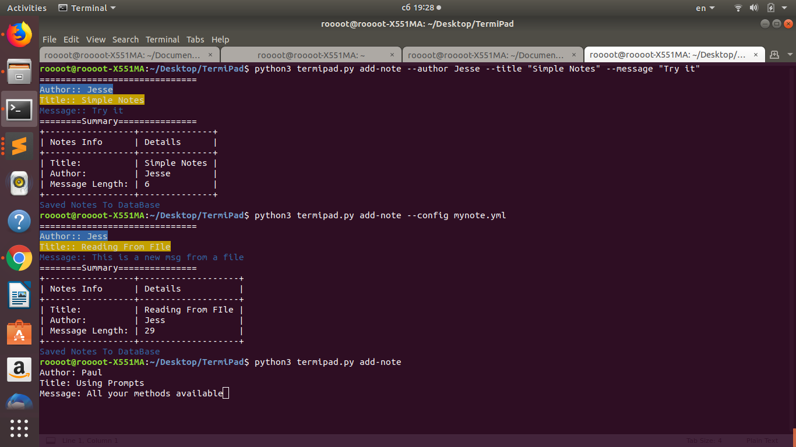
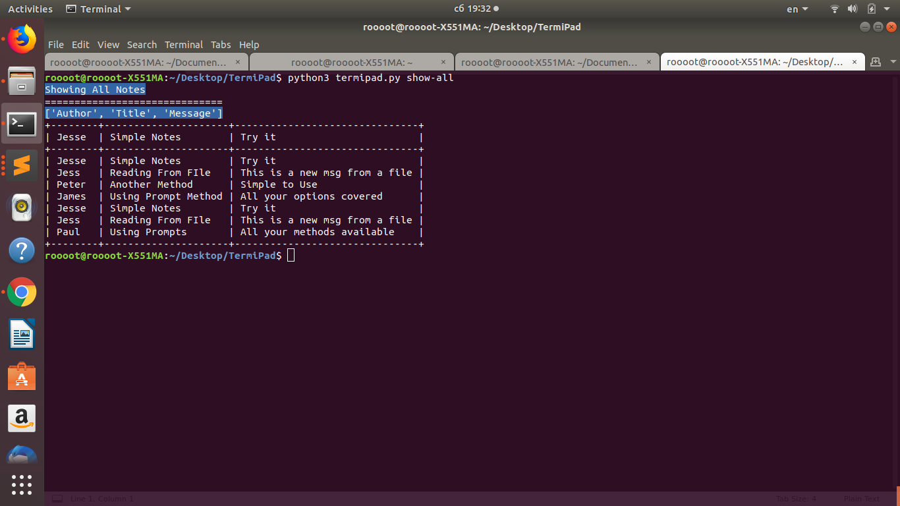

### README

### TermiPad
+ A Simple Note Taking CLI notepad

#### Requirements
+ Click
+ Click Config
+ TerminalTables
+ Sqlite3


### Benefits
+ Easy to use
+ Save your notes via the CLI
+ Cross Platform via Python

### Features
+ Add Notes
+ Edit Notes
+ Search Notes
+ Use config file with details of notes(ie .yaml/yml)


#### Usage
```bash

python termipad.py --help 

```




#### Adding Notes Via 3 Methods
+ Method 1 Via Arguments



+ Method 2,3 Via Prompt or Config File



#### Show All Notes



#### Search Notes By [Title/Author/Message]


#### More To Add


#### By
+ Jesse E.Agbe(JCharis)
+ Jesus Saves@JCharisTech